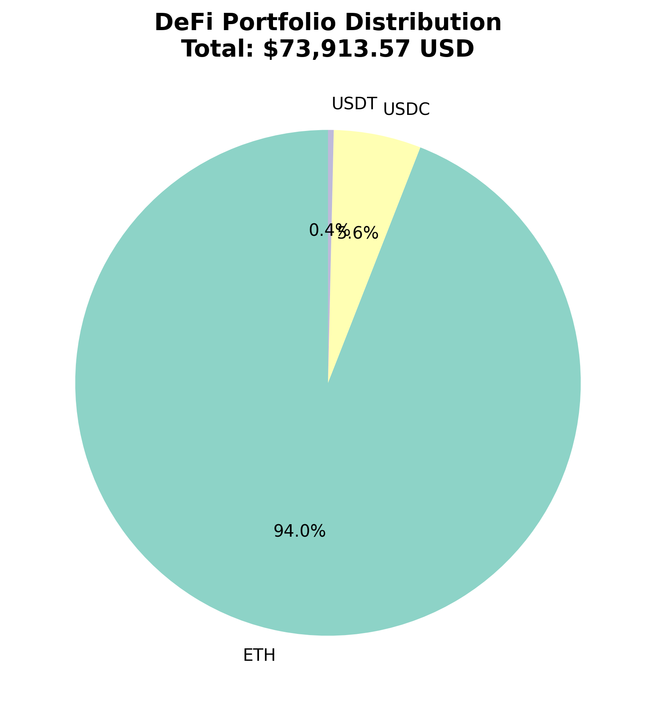

# 🏦 DeFi Portfolio Tracker

Real-time DeFi portfolio aggregator that tracks cryptocurrency balances across multiple wallets using Web3.py and visualizes holdings with interactive charts.



## 🎯 Features

- **Multi-Wallet Support**: Aggregate balances from multiple Ethereum addresses
- **Real-Time Pricing**: Fetch live cryptocurrency prices via CoinGecko API
- **ERC-20 Token Tracking**: Monitor USDC, DAI, USDT balances
- **ETH Balance**: Native Ethereum balance checking
- **Interactive Visualizations**: 
  - Plotly interactive bar charts
  - Matplotlib pie charts
  - CSV data export
- **USD Valuation**: Automatic portfolio value calculation in USD

## 🛠️ Tech Stack

- **Python 3.8+**
- **Web3.py**: Ethereum blockchain interaction
- **Requests**: CoinGecko API calls
- **Pandas**: Data manipulation
- **Matplotlib**: Static visualizations
- **Plotly**: Interactive charts
- **python-dotenv**: Environment variable management

## 📦 Installation
```bash
# Clone repository
git clone https://github.com/code-craftsman369/defi-portfolio-tracker.git
cd defi-portfolio-tracker

# Install dependencies
pip install -r requirements.txt

# Configure environment (optional)
cp .env.example .env
# Edit .env with your Infura/Alchemy API key
```

## 🚀 Usage

### Basic Usage (Public Node)
```bash
cd src
python3 portfolio_tracker.py
```

The script uses a public Ethereum node by default. For faster performance, configure your own provider:

### Advanced Usage (Custom Provider)

1. Create `.env` file in project root:
```env
INFURA_URL=https://mainnet.infura.io/v3/YOUR_PROJECT_ID
```

2. Run the tracker:
```bash
cd src
python3 portfolio_tracker.py
```

### Custom Wallet Addresses

Edit `src/portfolio_tracker.py` and modify the `wallet_addresses` list:
```python
wallet_addresses = [
    '0xYourAddress1',
    '0xYourAddress2',
    # Add more addresses
]
```

## 📊 Output

The tracker generates three files in the `output/` directory:

1. **portfolio_pie_chart.png**: Asset distribution pie chart
2. **portfolio_interactive.html**: Interactive Plotly visualization
3. **portfolio_data.csv**: Raw portfolio data

### Example Output
```
💰 Current Prices (USD):
   USDC: $1.00
   DAI: $0.99
   USDT: $1.00
   ETH: $2,934.02

============================================================
📈 PORTFOLIO SUMMARY
============================================================
Token      Balance  Price (USD)  Value (USD)
  ETH    23.692927  2934.020000  69515.520272
 USDC  4130.787928     0.999848   4130.160048
  DAI     0.000000     0.999424      0.000000
 USDT   268.176729     0.998942    267.892998
============================================================
💵 TOTAL PORTFOLIO VALUE: $73,913.57 USD
============================================================
```

## 🔧 Configuration

### Supported Tokens

Currently tracking:
- **ETH** (Native Ethereum)
- **USDC** (USD Coin)
- **DAI** (Dai Stablecoin)
- **USDT** (Tether)

To add more tokens, edit `src/config.py`:
```python
TOKEN_CONTRACTS = {
    'TOKEN_SYMBOL': '0xContractAddress',
}

COINGECKO_IDS = {
    'TOKEN_SYMBOL': 'coingecko-api-id',
}
```

## 📁 Project Structure
```
defi-portfolio-tracker/
├── src/
│   ├── portfolio_tracker.py    # Main tracker logic
│   └── config.py                # Token contracts & config
├── output/                      # Generated visualizations
│   ├── portfolio_pie_chart.png
│   ├── portfolio_interactive.html
│   └── portfolio_data.csv
├── data/                        # (Reserved for future use)
├── requirements.txt             # Python dependencies
├── .env.example                 # Environment template
└── README.md
```

## 🔐 Security Notes

- Never commit your `.env` file or API keys to version control
- The tracker only **reads** blockchain data (no private keys required)
- All API calls are read-only

## 🚧 Limitations

- Requires Ethereum mainnet connection (RPC provider)
- CoinGecko free tier has rate limits (50 calls/minute)
- Only supports ERC-20 tokens on Ethereum mainnet

## 🛣️ Roadmap

- [ ] Multi-chain support (Polygon, BSC, Arbitrum)
- [ ] Historical portfolio tracking
- [ ] Price alerts and notifications
- [ ] Web dashboard interface
- [ ] Additional DeFi protocols (Uniswap LP, Aave positions)

## 📄 License

MIT License - See [LICENSE](LICENSE) file

## 👤 Author

**Tatsu**  
GitHub: [@code-craftsman369](https://github.com/code-craftsman369)  
X: [@web3_builder369](https://twitter.com/web3_builder369)

---

⭐ If you find this project useful, please consider giving it a star!